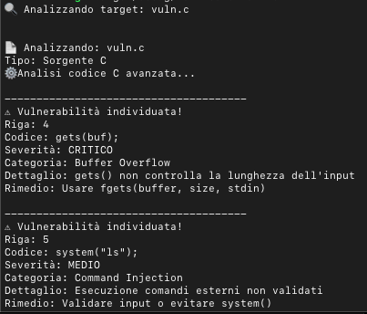

HexVigil is a Rust-based static analysis tool designed to detect common vulnerabilities in:

C source code

Scripts

Binary executables (ELF/PE/Mach-O)

Generic suspicious files

Its goal is to provide quick and clear insights to understand:

if a source code contains dangerous functions

if a binary executable has potential security issues

what corrective actions can be applied

## Features

The first version of HexVigil includes:

🔍 C Source Code Analysis

Automatic detection of risky patterns such as:

gets()

scanf() without limits

strcpy / strcat

system()

sprintf

For each detected issue, the tool provides:

line number

relevant code snippet

severity

## Binary Analysis

Supported formats:

ELF (Linux)

PE (Windows)

Mach-O (macOS)

Implemented checks:

suspicious string scanning

dangerous function detection

malicious pattern detection

entropy analysis (packer/obfuscation detection)

general static security analysis
technical details

remediation suggestions

## Recursive Directory Scanning

HexVigil can analyze:

a single file

an entire folder

all recognized source or binary files

🛠 Requirements

Rust toolchain (cargo + rustc)

macOS / Linux / Windows

## Installation

Clone the repository:

git clone https:// github.com/<your-username>/HexVigil.git
cd HexVigil

## Build:

cargo build

## Usage
Analyze a single file
cargo run -- path/to/file.c

## Analyze a folder
cargo run -- /path/to/folder

## Verbose mode
cargo run -- path/to/file --verbose

